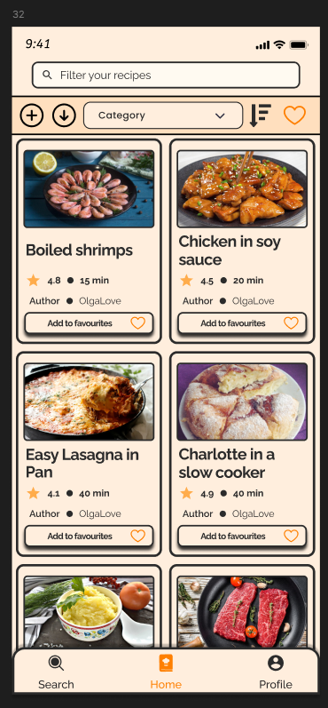
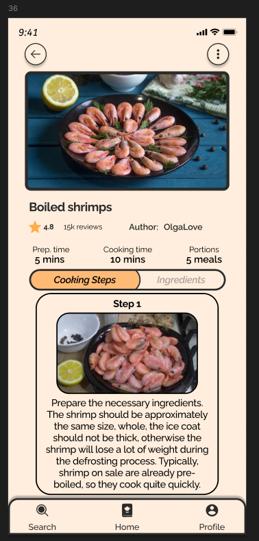
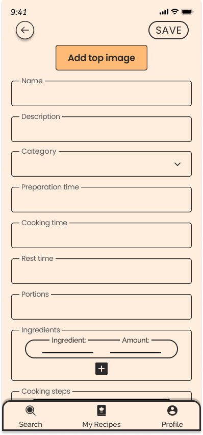
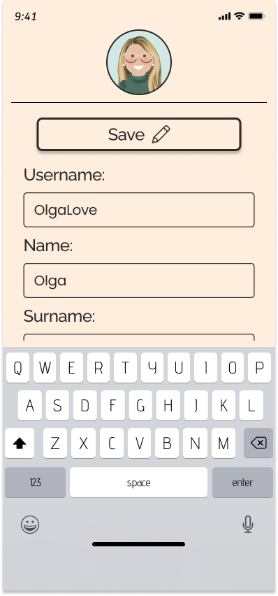
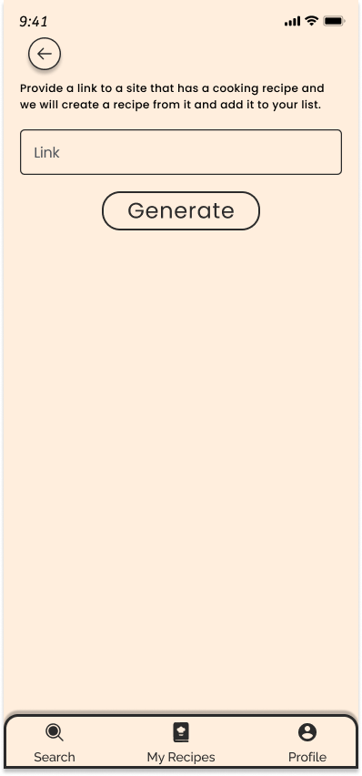

![CookingCorner][cookingcorner-logo]

# Cooking Corner

[Mobile repository][mobile-repository]

## Agenda
* [About the project](#about-the-project)
* [Demo](#demo)
* [Installation](#installation)
* [Features](#features)
* [License](#license)
* [Contacts](#contacts)

## About the project

Cooking Corner is a project that combines a mobile application for iOS and Android, and a website. 
The project is written using FastAPI (backend), PostgreSQL (database), React (frontend), 
Kotlin Multiplatform, Compose Multiplatform, Ktor, Kodein, Decompose + MviKotlin (mobile application). 
Cooking Corner is a convenient and beautiful service for sharing recipes between experienced and inexperienced people in cooking. 
Both experienced chefs can share delicious recipes, and completely inexperienced in cooking people can learn how to 
cook unusual dishes. The project implements user registration and authorization, users can add recipes, 
search for recipes by name, by category or by tag, add other people's recipes to favorites, 
share recipes with other users. In the future, we plan to implement AI functions such as recipe recommendations, 
smart search, and recipe generation on request.

## Demo
[Demo][demo]

## Installation

You can install our app by downloading the following APK file:

[Mobile installer][mobile-installer]

Or use our website:

[Website][website]

## Features

* Get access to the popular recipes from our database:

* Follow the simple steps to cook your favorite meal:

* Create your own recipes:

* Express yourself through your user page:

* AI feature: import recipe from any website by its URL:

## License

[MIT](https://choosealicense.com/licenses/mit/)

## Contacts

For any questions or suggestions, contact:
* Anton Chulakov - Teamlead, Designer - a.chulakov@innopolis.university
* Denis Mikhailov - Backend Developer - d.mikhailov@innopolis.university
* Arseny Savchenko - Mobile Developer - a.savchenko@innopolis.university
* Ilya Zubkov - Frontend Developer - i.zubkov@innopolis.university
* Sergey Atkonov - Quality Assurance - s.atkonov@innopolis.unniversity

[cookingcorner-logo]: readme_files/logo.png
[mobile-repository]: https://github.com/dinaraparanid/Cooking-Corner-KMP
[mobile-installer]: https://github.com/dinaraparanid/Cooking-Corner-KMP/releases
[website]: http://cookingcorner.ru/
[demo]: https://youtu.be/E3vYDSHEvSY?si=Uvb8gkH7D9IL7QJp

